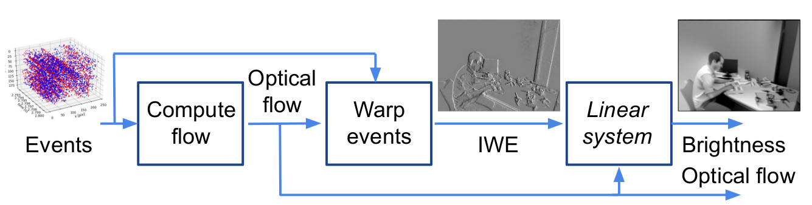

# Formulating Event-based Image Reconstruction as a Linear Inverse Problem with Deep Regularization using Optical Flow



The code here is related to the **TPAMI 2022 paper: [Formulating Event-based Image Reconstruction as a Linear Inverse Problem with Deep Regularization using Optical Flow](https://doi.org/10.1109/TPAMI.2022.3230727)**, by Zelin Zhang, [Anthony Yezzi](https://scholar.google.ch/citations?user=CZiW6c8AAAAJ) and [Guillermo Gallego](https://sites.google.com/view/guillermogallego)

The [PDF of the paper is available](https://arxiv.org/pdf/2112.06242). If you use this work in your research, please cite it as follows:

```bibtex
@article{Zhang22pami,
  author = {Zhang, Zelin and Yezzi, Anthony and Gallego, Guillermo},  
  title = {Formulating Event-based Image Reconstruction 
  as a Linear Inverse Problem with Deep Regularization using Optical Flow},
  journal = {{IEEE} Trans. Pattern Anal. Mach. Intell.},
  year = {2022},
  doi = {10.1109/TPAMI.2022.3230727}
}
```

The paper proposes a new approach to reconstruct image intensity from events. Assume the optical flow during a short time interval `[t0, t1]` is known, which can be estimated by any existing method (e.g., [Contrast Maximization](https://github.com/tub-rip/event_based_optical_flow)). The events can be warped by the optical flow to a certain timestamp `t (t0<=t<=t1)` and form the image of warped events (IWE). The IWE is typically sharp and represents scene edges (in the direction of optical flow). The strength (from IWE) and direction (from optical flow) of the edges impose constraints on the image intensity. For example, assume we move the camera vertically and upward so that the optical flow is strictly vertical and points downward, the IWE should be full of horizontal edges. At each edge, we know `pixel_intensity_above - pixel_intensity_below = edge_strength`. These constraints can be formulated as a series of linear equations and form an inverse problem. We reconstruct the image by solving this inverse problem. But of course we need some regularization. Please see more details in the [paper](https://arxiv.org/pdf/2112.06242).


# Instructions to run the code

## Create an environment

Please install [conda](https://docs.conda.io/en/latest/miniconda.html#linux-installers), and use the provided `environment.yml` file to install packages:
```
conda env create --file environment.yml
```

## Create folders and download model
Navigate to the root directory of this repository in the terminal and run:
```
mkdir results && mkdir denoiser_model
```
Then download the CNN denoiser from [here](https://drive.google.com/file/d/1oSsLjPPn6lqtzraFZLZGmwP_5KbPfTES/view?usp=sharing) and put it into the `denoiser_model` folder.
(The model file (drunet_gray.pth) is originally from [here](https://github.com/cszn/DPIR/tree/master/model_zoo))

The `results` folder will be used to store the reconstructed images.

## Run the code
First make sure the conda environment is activated:
```
conda activate img_rec
```
Then run:
```
python main.py
```

The reconstructed images can be found in the `results` folder. 

# Reconstruct an image with ground truth optical flow(IJRR dataset)

[IJRR dataset](https://rpg.ifi.uzh.ch/davis_data.html) provides some sequences with pure rotation camera motion. These sequences are ideal to evaluate the method because the optical flow can be computed from the angular velocity and it can be found in IMU data, which is included in the dataset.

First, checkout the `ijrr` branch.
```
git checkout ijrr
```
Then, create a folder named `data` (the preparation work in the previous section is considered complete at this moment, otherwise please do it)
```
mkdir data
```
Next, download one of the rotation sequences, such as `boxes_rotation`, and put it into the folder.

Then, we have to split the big dataset into small chunks to avoid loading too many events into the RAM later.
```
python split_events_imu.py boxes_rotation
```
(please make sure you are in the root directory of this repository and the conda environment is activated and change the `boxes_rotation` to the name of the sequence you just downloaded)

Finally, run:
```
python run_ijrr.py boxes_rotation --start_time 19.5 --num_events 30000
```
* Please change `boxes_rotation` to the name of the sequence you downloaded.
* The parameter `start_time` decides at which time in the sequence to load events.
* The parameter `num_events` decides how many events to load.

The reconstructed images can be found in the `results` folder. 

# Reconstruct an image with your own optical flow

The code structure is specially designed to facilitate the process for the user to modifiy the code and reconstruct an image if he/she has his/her own optical flow estimation method.

If you want to reconstruct an image from events and optical flow:

```python
from utils.utils_img_rec import ImageReconstructor
events, flow = load_events_and_flow(dataset)
image_reconstructor = ImageReconstructor(flow)
img_rec_l1 = image_reconstructor.image_rec_from_events_l1(events, reg_weight=1e-1)
img_rec_l2 = image_reconstructor.image_rec_from_events_l2(events, reg_weight=3e-1)
img_rec_denoiser = image_reconstructor.image_rec_from_events_cnn(events, weight1=2.5, weight2=1.3)
```

* In simple words, you just have to provide `flow` to initialize the `ImageReconstructor` and pass the `events` to a specific reconstruction method. 
You shall change the regularization weight to obtain the optimal result.
* Please note that the events and flow should be provided in the shape of `[batch_size, N, 4]`, `[batch_size, 2, H, W]` and in `torch.Tensor`.(N means the number of events, H, W are the height and width of the image resolution). The reason for this convention is the current trend of optical flow estimation is using deep learning. The flow and events are often converted to `torch.Tensor` and have an extra `batch_size` dimension.

If you want to reconstruct image from the IWE and optical flow:

```python
from utils.utils_img_rec import ImageReconstructor
iwe, flow = load_iwe_and_flow(dataset)
image_reconstructor = ImageReconstructor(flow)
img_rec_l1 = image_reconstructor.image_rec_from_iwe_l1(iwe, reg_weight=1e-1)
img_rec_l2 = image_reconstructor.image_rec_from_iwe_l2(iwe, reg_weight=3e-1)
img_rec_denoiser = image_reconstructor.image_rec_from_iwe_cnn(iwe, weight1=2.5, weight2=1.3)
```
Similarly, the IWE and flow should be provided in the shape of `[batch_size, 1, H, W]`, `[batch_size, 2, H, W]` and in `torch.Tensor`.

Please see the **two examples** in `main.py` for more details.

# Acknowledgements

This code borrows from the following open source projects, whom we would like to thank:

- [Deep Plug-and-Play Image Restoration](https://github.com/cszn/DPIR)
- [Back to Event Basics: SSL of Image Reconstruction for Event Cameras](https://github.com/tudelft/ssl_e2vid)

# Additional Resources

* [Secrets of Event-Based Optical Flow (ECCV 2022)](https://github.com/tub-rip/event_based_optical_flow)
* [Research page (TU Berlin RIP lab)](https://sites.google.com/view/guillermogallego/research/event-based-vision)
* [Course at TU Berlin](https://sites.google.com/view/guillermogallego/teaching/event-based-robot-vision)
* [Survey paper](http://rpg.ifi.uzh.ch/docs/EventVisionSurvey.pdf)
* [List of Resources](https://github.com/uzh-rpg/event-based_vision_resources)
